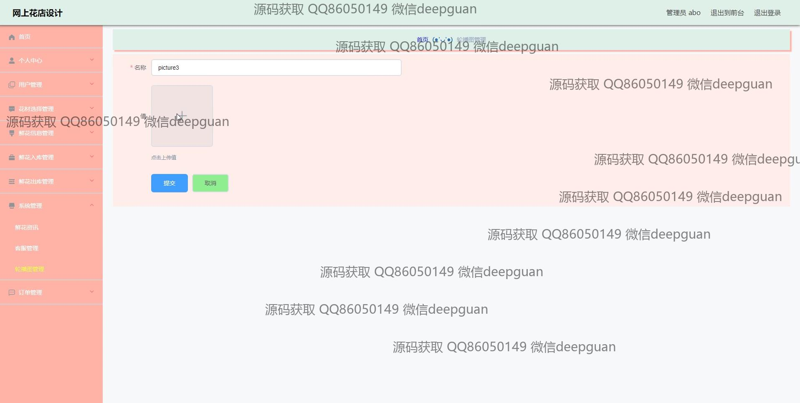

<h1 align="center">网上花店设计+vue</h1>

## 简介
网上花店设计：角色分为管理员、用户；用户管理、花材选择管理、订单管理、鲜花信息管理；支持购物车功能、用户评价、在线支付和订单跟踪等。    --计算机毕业设计源码；毕设源码；java毕业设计源码

## 联系方式

<h3 align="center">获取完整代码与数据库文件 + 微信：deepguan QQ: 86050149 QQ群: 783742310</h3>

<h3 align="center">可帮忙远程部署 包运行成功！提供远程部署、修改代码、设计文档指导、代码讲解等服务！</h3>

## 功能介绍（完整见运行截图）
管理员：登录、注册、退出，管理网站导航及各类花艺产品，负责管理用户信息、订单和库存，能够编辑和修改鲜花信息及更新系统设置，通过后台管理查看和更新花店相关数据，提供用户管理、花材选择、订单管理、系统管理等功能。  
用户：支持登录、注册、退出，通过主页导航访问各类商品，浏览和选择鲜花产品，查看花卉详情并进行购物车和订单管理，可以查看个人信息并进行编辑和修改，通过个人中心查看订单、地址、收藏等信息，并参与评价和互动。

## 运行截图

本代码来源于网络,仅供学习参考使用!

